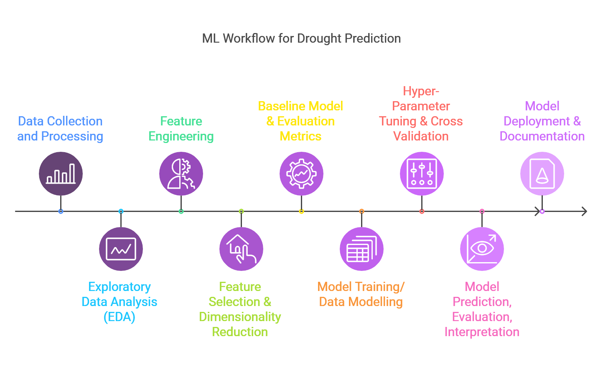
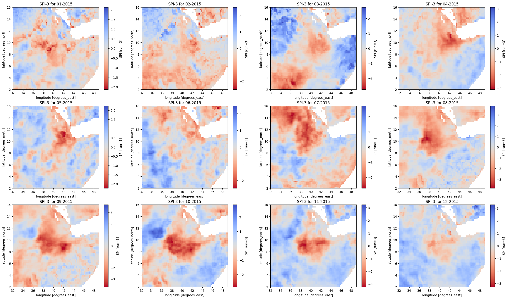
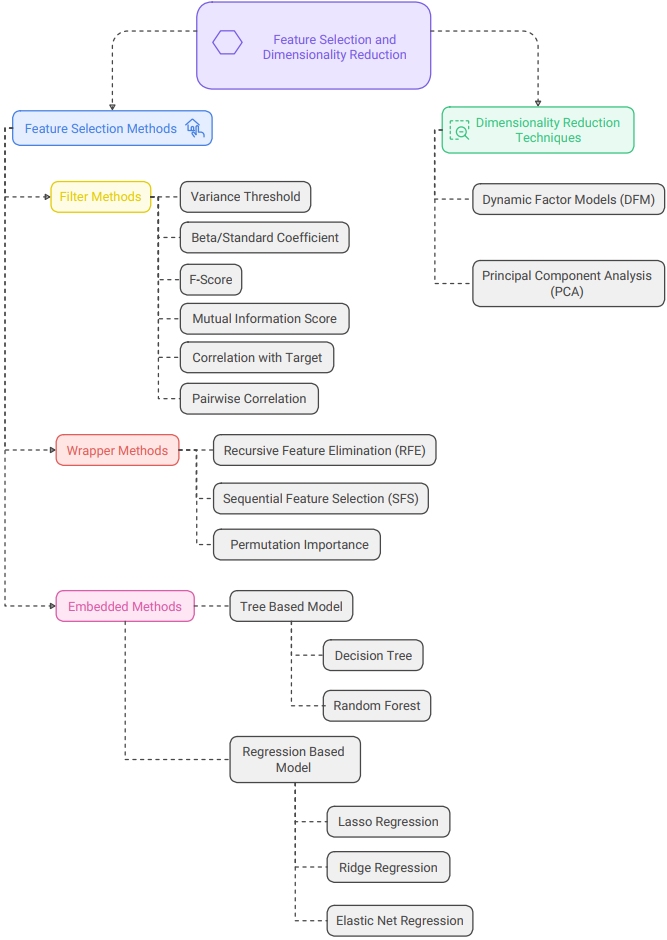
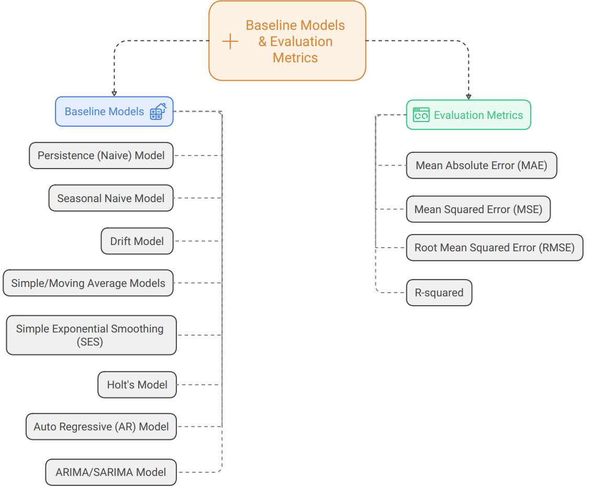
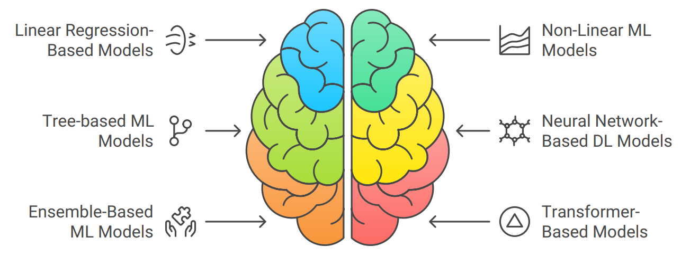
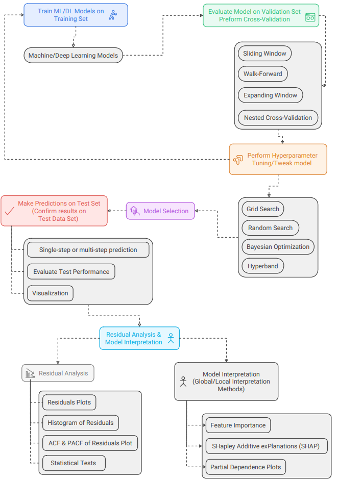
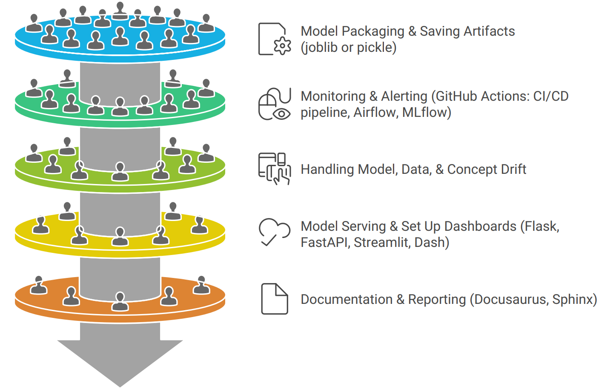
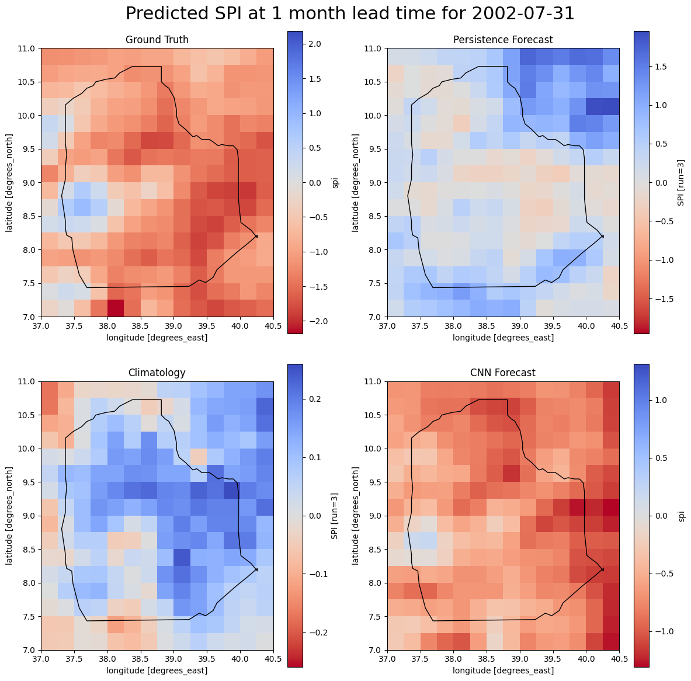

Deep Learning Approaches to Drought Prediction
==============================

## **Introduction**

Welcome to the GitHub repository for **Deep Learning Approaches to Drought Prediction**. This project explores the application of advanced deep learning models to predict drought conditions with improved accuracy and timeliness.  We aim to develop AI-driven solutions that support climate resilience and water resource management.

Drought is a significant natural disaster that impacts agriculture, water resources, ecosystems, and socio-economic activities. Early warning systems play a crucial role in mitigating the impacts of drought by providing timely information to decision-makers. 

Ethiopia frequently experiences devastating droughts that severely impact agricultural production and food security for millions of people. To mitigate the impacts of these extrem events , we need to develop accurate and reliable drought prediction models. This project aims to develop a deep learning-based drought prediction model that uses the state-of-the-art data driven modeling techniques to predict drought conditions with high accuracy at sufficient lag/lead times.

Machine/Deep learning techniques have the potential to revolutionize drought forecasting by improving accuracy and lead time. By leveraging advanced data analytics and deep learning algorithms, more accurate and realable drought prediction models can be developed.

Our work focuses on employing cutting-edge techniques, such as **Recurrent Neural Networks (RNNs)**, **Long Short-Term Memory (LSTM) networks**, **Convolutional Neural Networks (CNNs)**, and **Transformer** models, to analyze complex spatio-temporal patterns of drought. Drought predictions can help decision-makers mitigate the impacts of droughts and plan for sustainable resource allocation.

The overarching goals of the project are:  
1. Prepare and compile features/predictors from various datasets relevant for drought prediction.  
2. Calculate the Standardized Precipitation Index (SPI) as a standardized drought indicator.  
3. Implement and evaluate deep learning models for drought prediction.   
4. Develop a machine learning workflow that is both reproducible and scalable to other regions or predictors. 
5. Develop actionable early warning tool to support decision-making.    

This repository includes:
- **Code and Models:** Implementation of deep learning architectures for drought prediction.
- **Datasets:** Data preprocessing steps and preprocessed datasets used for training and testing of ML/DL models.
- **Documentation:** Step-by-step guides for replicating the experiments.
- **Visualization Tools:** Visualize drought patterns and model outputs.

## Methodology

In this project , we employ a robust and scalable  multi-step approach to develop a machine/deep learning-based drought prediction model. The methodology involves:

### **1. Data Collection and Processing**
- Precipitation data collection (CHIRPS dataset from 1981 to 2020)
- Predictor data collection 
    - Local/regional predictors 
    - Atmospheric and Oceanic predictors 
        - Oceanic climate indices were gathered from 1981-2022, including Nino SST regions, SOI, NAO, and IOD.
        
        - Atmospheric data compiled included OLR, zonal winds at various pressure levels, and zonally averaged temperature anomalies.

- **Preprocessing Steps:** 
- Handle missing values 
- Ensure temporal alignment of datasets.
- SPI Calculation (SPI1, SPI2, SPI3, SPI4, SPI6, SPI12, SPI15, SPI24 etc)

For example , the following 3-month SPI map for 2015 calculated from CHRIPS dataset is shown below and can be used to visualize the drought patterns in the region.

The result from the 3-month SPI map matches the drought patterns observed in the region during 2015. According to USAID, GFDRE, Famine Early Warning System reports:

- North and central/eastern Ethiopia has experienced the worst drought in more than 50 years.  
- The drought affected nearly 10 million Ethiopians.

- In 2015, after a false start, the belg rains came a month late in northern and central Ethiopia and kiremt season was delayed and the rains were erratic and below average.  

- February to May Belg rains were erratic and well below average; and the subsequent June to September Kinemt rains started late and were also significantly below average.    

---

### **2. Exploratory Data Analysis (EDA)**
- **Visualization:** Use plots and heatmaps to analyze temporal trends and spatial distributions.
- **Statistical Analysis:** Identify relationships between predictors (e.g., rainfall, temperature) and drought indicators (e.g., SPI).

---

### **3. Feature Engineering**

- **Time-based features**:
    - Create month, seasons, yearly as features 
    - Create cyclic monthly features (seasonality components.)
    - Add lagged variables as features 

- **Location based features**: 
  - Spatial Encoding/Geohashing
  - Coordinate-Based Transformations (Sine and Cosine Transformation

---

### **4. Feature Selection and Dimensionality Reduction**

- **Statistical and filter based methods:** Use correlation analysis and hypothesis testing to select relevant features.

- **Warpper Methods:** 

- **Machine Learning Approaches:** 

---

### **5. Baseline Model & Evaluation Metrics**
- **Model Selection:** Build simple regression or decision tree models as baselines.

- **Evaluation Metrics:** Use metrics like Mean Absolute Error (MAE), Root Mean Squared Error (RMSE), or precision-recall for classification tasks.

---

### **6. Model Training, Hyperparameter Tuning, and Cross-Validation**

- **Model Training:** Implement models such as Long Short-Term Memory (LSTM) networks, Convolutional Neural Networks (CNNs), or hybrid spatio-temporal models.

- **Hyperparameter Optimization:** Use hyperparameter optimization techniques (e.g., grid search, random search, Bayesian optimization) for improved performance.

- **Cross-Validation:** Employ k-fold cross-validation to ensure model robustness.

---

### **7. Model Prediction, Evaluation, and Interpretation**  

- **Prediction:** Forecast drought severity or likelihood in specific regions.
- **Evaluation:** Compare predictions against historical data or expert observations.
- **Interpretation:** Use techniques like SHAP values or feature importance plots to understand model decisions.

---

### **8. Model Deployment and Documentation**
- **Deployment:** Create APIs or integrate models into dashboards for stakeholders.
- **Documentation:** Provide clear guidelines for replicating the workflow and interpreting outputs.

---

This methodology ensures accurate and actionable drought predictions while emphasizing reproducibility and scalability, empowering decision-makers with timely insights to address drought challenges.

---

### Comparison of Ground Truth, Persistence, Climatology & CNN predictions

