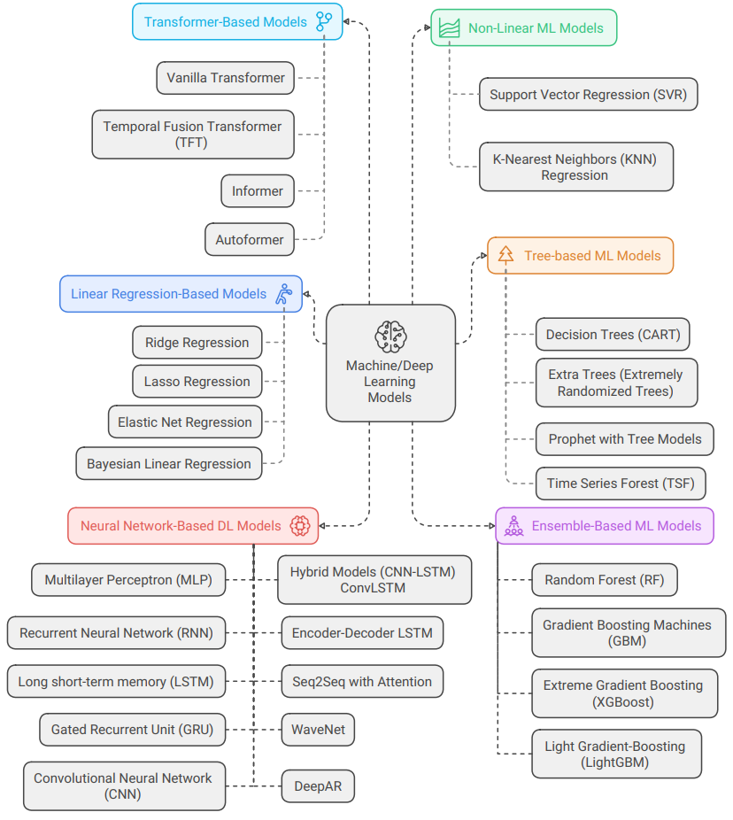

# Deep Learning Approaches to Drought Prediction

## **Introduction**

Welcome to the GitHub repository for **Deep Learning Approaches to Drought Prediction**. This project explores the application of advanced deep learning models to predict drought conditions with improved accuracy and timeliness.  We aim to develop AI-driven solutions that support climate resilience and water resource management.

Drought is a significant natural disaster that impacts agriculture, water resources, ecosystems, and socio-economic activities. Early warning systems play a crucial role in mitigating the impacts of drought by providing timely information to decision-makers. 

Ethiopia frequently experiences devastating droughts that severely impact agricultural production and food security for millions of people. To mitigate the impacts of these extrem events , we need to develop accurate and reliable drought prediction models. This project aims to develop a deep learning-based drought prediction model that uses the state-of-the-art data driven modeling techniques to predict drought conditions with high accuracy at sufficient lag/lead times.

Machine/Deep learning techniques have the potential to revolutionize drought forecasting by improving accuracy and lead time. By leveraging advanced data analytics and deep learning algorithms, more accurate and realable drought prediction models can be developed.

Our work focuses on employing cutting-edge techniques, such as **Recurrent Neural Networks (RNNs)**, **Long Short-Term Memory (LSTM) networks**, **Convolutional Neural Networks (CNNs)**, and **Transformer** models, to analyze complex spatio-temporal patterns of drought. Drought predictions can help decision-makers mitigate the impacts of droughts and plan for sustainable resource allocation.

The overarching goals of the project are:  


1. _Prepare and compile features/predictors from various datasets relevant for drought prediction._

2. _Calculate the Standardized Precipitation Index (SPI) as a standardized drought indicator._  

3. _Implement and evaluate deep learning models for drought prediction._  

4. _Develop a machine learning workflow that is both reproducible and scalable to other regions or predictors._ 

5. _Develop actionable early warning tool to support decision-making._

This repository includes:
- **Code and Models:** Implementation of deep learning architectures for drought prediction.
- **Datasets:** Data preprocessing steps and preprocessed datasets used for training and testing of ML/DL models.
- **Documentation:** Step-by-step guides for replicating the experiments.
- **Visualization Tools:** Visualize drought patterns and model outputs.

## Methodology

In this project , we employ a robust and scalable  multi-step approach to develop a machine/deep learning-based drought prediction model. The methodology involves:


### **1. Data Collection and Processing**

#### **Data Collection**

- **Daily precipitation** data was obtained from the **Climate Hazards Group InfraRed Precipitation with Station (CHIRPS)** dataset, covering the period from 1981 to 2020.

- Python script was used to automate the process of downloading from the CHIRPS website and processing the data into a suitable format for analysis.

- The **Climate Data Operator (CDO)** tools were utilized to **clip data to the Ethiopian domain**, **merge files** into consolidated netCDF files, and **aggregate daily data into monthly** time steps.

- Predictor data collection: Monthly average **ERA5-Land reanalysis** data with a 9 km resolution, spanning the period from 1981 to 2020, was utilized as predictor data.

    - Local/regional predictors

        1) Temperature
        2) Precipitation
        3) Soil Temperature
        4) Wind and  Pressure
        5) Vegetation
        6) Radiation and Heat
        7) Evaporation 
        8) Soil Water
        9) Runoff

    - Atmospheric and Oceanic predictors 
    
        - Both atmospheric and oceanic indices were gathered from 1981-2022.

        - Nino region SST indices (Nino 1+2, Nino 3, Nino3.4, Nino 4)  from Extended Reconstruction SSTs Version 5 (ERSSTv5) dataset is collected.

        - Southern Oscillation Index (SOI).
        
        - North Atlantic Oscillation (NAO) Index.
        
        - Indian Ocean Dipole (IOD) Index.

        - The collected atmospheric climate indices include the following:
        
            - Outgoing Long Wave Radiation Equator.
            - Zonal Winds Equator (200mb).
            - Trade Wind Index (zonal) West Pacific (850mb)
            - Trade Wind Index (zonal) Central Pacific  (850mb)
            - Trade Wind Index (zonal) East Pacific  (850mb)
            - Zonally Average Temperature Anomalies ( 500mb)

#### **Preprocessing Steps**
- Handle missing values 
- Ensure temporal alignment of datasets
- **SPI Calculation**
    - NCL code was created to compute the Standardized Precipitation Index (SPI) at various intervals, including SPI1, SPI2, SPI3, SPI4, SPI6, SPI12, SPI15, SPI24 and others.


For example , the above 3-month SPI map for 2015 calculated from CHRIPS dataset and can be used to visualize the drought patterns in the region.

The result from the 3-month SPI map matches the drought patterns observed in the region during 2015. According to USAID, GFDRE, Famine Early Warning System reports:

- North and central/eastern Ethiopia has experienced the worst drought in more than 50 years.  
- The drought affected nearly 10 million Ethiopians.

- In 2015, after a false start, the belg rains came a month late in northern and central Ethiopia and kiremt season was delayed and the rains were erratic and below average.  

- February to May Belg rains were erratic and well below average; and the subsequent June to September Kinemt rains started late and were also significantly below average.

---

### **2. Exploratory Data Analysis (EDA)**

**Exploratory Data Analysis (EDA)** is an analytical approach aimed at uncovering the inherent characteristics of datasets, utilizing **statistical (non-graphical)** and **visualization (graphical)** techniques.

Objective: to gain insights into the data by summarizing its main characteristics:

 - Find patterns
 - Identify outliers
 - Explore the relationship between variables
 - Helps to indentify features (aka feature selection)

Some of the EDA techniques used in this project include:

- Basic Statistical Summary
- Visualization 
    - Histogram and Density Plot
    - Box Plots
    - Violin Plot
    - Time Series Plot and Bar Chart
    - Correlation Analysis
    - Bivariate Relationships (Bivariate Scatter and Pair Plot )
- Automatic EDA Tools

---

### **3. Feature Engineering**

Feature engineering is a machine learning technique of creating new features or modifying existing ones from raw data to enhance the performance of machine learning models. It involves extracting meaningful information from raw data, reducing noise, and transforming variables to make them more suitable for modeling. Some common techniques used in feature engineering include:

1) Domain Knowledge Based Feature Engineering 

2) Time Series Feature Engineering

    - Datetime Features: Create month, seasons, yearly as features 
    - Create cyclic monthly features (seasonality components.)
    - Lag-based Features 

3) Location based features

    - Spatial Encoding/Geohashing
    - Coordinate-Based Transformations (Sine and Cosine Transformation)

4) Scaling and Normalization

5) Mathematical Transformations 

6) Creating Interaction Features (Polynomial Feature Generation)

---

### **4. Feature Selection and Dimensionality Reduction**

The goal of feature selection is to select a subset of the most relevant features that are most useful for the model. The following methods can be used for feature selection:
  - Statistical and filter based methods. 
  
  - Warpper Methods 
  
  - Machine Learning Approaches

The goal of dimensionality reduction is to reduce the number of features while retaining the most important information in the data. The figure bellow shows both the feature selection and dimensionality reduction methods:


---

### **5. Baseline Model & Evaluation Metrics**

**Baseline models** can be used to compare the performance of different models. Some common baseline models shown in the figure below:

**Evaluation metrics** are used to measure the performance of a model. Some common evaluation metrics are shown in the figure below:


---

### **6. Model Training, Hyperparameter Tuning, Cross-Validation, Prediction, Evaluation, &  Interpretation**

**Model Training:** The following image shows the general catagories of machine/deep learning models used in the tranining process:


The following image shows detail ML/DL models used in the tranining process:




**Hyperparameter Optimization:** Use hyperparameter optimization techniques (e.g., grid search, random search, Bayesian optimization) for improved performance.

**Cross-Validation:** Employ k-fold cross-validation to ensure model robustness.

**Prediction:** Forecast drought severity or likelihood in specific regions.
 
**Evaluation:** Compare predictions against historical data or expert observations.

**Interpretation:** Use techniques like SHAP values or feature importance plots to understand model decisions.


The following image shows the workflow of model training, hyperparameter tuning,cross-validation,prediction, evaluation, and interpretation:


---

### **7. Model Deployment and Documentation**
**Deployment:** Create APIs or integrate models into dashboards for stakeholders.

**Documentation:** Provide clear guidelines for replicating the workflow and interpreting outputs.

The following image shows the workflow of model deployment and documentation:


---

This methodology ensures accurate and actionable drought predictions while emphasizing reproducibility and scalability, empowering decision-makers with timely insights to address drought challenges.


---

### Drought Prediction Using Convolutional Neural Network (CNN) as a Baseline Model 

**Convolutional Neural Network (CNN)** architecture is ideal for applications in climate science, where spatial data plays a crucial role. It can be used for:

- Drought prediction.
- Precipitation classification.
- Soil moisture estimation.
- Climate variable forecasting.

Key Components of the CNN Model

**Input Data**: The training set consists of spatial data grids, which are reshaped into smaller tiles or patches for easier processing.

**Convolutional Layers**: Multiple convolutional layers (e.g., Conv Layer 1, Conv Layer 2, etc.) are employed to extract features from the spatial data.
Each convolutional layer applies a series of filters (e.g., 8, 16, 32, 64 filters) with a kernel size of 5x5 to detect spatial patterns and hierarchical features.

**ReLU Activation**: Non-linear activation functions are applied after each convolution to introduce non-linearity and improve feature extraction.
Pooling Layers:

**Max-Pooling Layers** (2x2): Reduce the spatial dimensions of feature maps, making computations efficient and focusing on the most important features.

**Fully Connected Layer**: After the convolutional and pooling layers, the extracted features are flattened and passed into a fully connected layer with 1024 neurons.
This layer captures global relationships and prepares the data for classification or regression tasks.

**Output Layer**: The final layer provides a classification or prediction result, represented as one of several possible categories (e.g., C? with options 1, 2, 3, 4).

**Forward Pass and Backpropagation**

- **Forward Pass**: The input data passes through the convolutional, pooling, and fully connected layers to generate predictions.
- **Backpropagation**: The model adjusts weights and biases during training by calculating errors and propagating them backward to optimize performance.


This workflow demonstrates the process of preparing data, building and training a CNN model, making predictions, and evaluating performance for drought prediction using SPI. It highlights the superiority of CNNs over traditional baseline methods. Below is a step-by-step breakdown:

### **1. Data Preparation**
- **Extract Train, Validation, and Test Data:**

The dataset is divided into training, validation, and testing subsets based on specified time periods.

| Data Type | Start Date | End Date | Percentage of Total Data |
| --- | --- | --- | --- |
| Training | 1981-01-01 | 2013-01-01 | 76.19%|
| Validation | 2013-01-01 | 2019-01-01 | 10.00% |
| Test | 2019-01-01 | 2023-01-01 | 5.00%|

- **Number of years in each dataset**

| Data Type | Number of Years |
| --- | --- |
| Training | 32 years |
| Validation | 6 years |
| Test | 4 years |


- **Normalization:**
  The training data's mean and standard deviation are computed and used to normalize the data across all subsets for consistent scaling.

### **2. Feature and Target Variable Preparation**
  - Features  are derived by removing the last lead_steps elements.
  - Targets are the corresponding values offset by lead_steps.


### **3. CNN Model Definition**

- **Model Architecture:**
  - A sequential model with `three Conv2D` layers is created.
  - The first two layers use `128 filters` with `tanh` activation and a kernel size of `3`.
  - The final layer outputs predictions using one filter.

- **Model Summary**

```
Layer (type)                 Output Shape              Param #
=================================================================
conv2d (Conv2D)              (None, 16, 14, 128)       1280
conv2d_1 (Conv2D)            (None, 16, 14, 128)       147584
conv2d_2 (Conv2D)            (None, 16, 14, 1)         1153
=================================================================
Total params: 150,017
Trainable params: 150,017
Non-trainable params: 0
```

- **Total Parameters:** The model has a total of **150,017 parameters**.
- **Trainable Parameters:** All 150,017 parameters are trainable since there are no frozen layers or non-trainable components.


- **Model Architecture Parameters**

| **Layer**       | **Type**       | **Output Shape**     | **Filters** | **Kernel Size** | **Padding** | **Activation** | **Parameters** |
|------------------|----------------|----------------------|-------------|-----------------|-------------|----------------|----------------|
| Input Layer      | Input          | (16, 14, 1)         | -           | -               | -           | -              | -              |
| Conv Layer 1     | Conv2D         | (16, 14, 128)       | 128         | 3x3             | Same        | Tanh           | 1,280          |
| Conv Layer 2     | Conv2D         | (16, 14, 128)       | 128         | 3x3             | Same        | Tanh           | 147,584        |
| Conv Layer 3     | Conv2D         | (16, 14, 1)         | 1           | 3x3             | Same        | None           | 1,153          |

---

- **Layer-wise Details:**

   - The first convolutional layer uses 128 filters and applies a `tanh` activation function.
   - The second convolutional layer repeats the same configuration.
   - The final convolutional layer reduces the output to a single channel with no activation function (default linear activation).


### **4. Training the CNN Model**

- **Compilation:**
  - The model is compiled with the `Adam` optimizer and `Mean Squared Error (MSE)` as the loss function.
  - The `Mean Absolute Error (MAE)` is tracked as a performance metric.

- **Early Stopping:**
  - The training process stops if validation loss does not improve for 10 epochs, restoring the best weights.
- **Model Fitting:**
  - The model is trained using the training data, with validation data provided for monitoring.

- **Training Parameters**

```markdown
| **Parameter**         | **Description**                       | **Value**       |
|------------------------|---------------------------------------|-----------------|
| **learning_rate**      | Step size for weight updates          | `0.001`         |
| **optimizer**          | Optimization algorithm                | `Adam`          |
| **loss**               | Function to evaluate performance      | `mse`           |
| **metrics**            | Metric to track during training       | `mae`           |
| **batch_size**         | Samples per gradient update           | `32`            |
| **epochs**             | Total training iterations             | `20`            |
| **validation_data**    | Dataset for validation                | `(X_valid, Y_valid)` |
| **callbacks**          | Callback functions applied            | `early_stopping`|


### **5. Prediction**
- **Generate Predictions:**
  - The trained model is used to predict SPI values for the training, validation, and testing periods.
- **Rescaling Predictions:**
  - Predictions are converted back to the original scale by reversing the normalization process using the stored mean and standard deviation.

---


### **5. Model Evaluation**

- **Area-Weighted RMSE:** The `Root Mean Square Error (RMSE)` is computed for the CNN model and compared with baseline approaches like `persistence` and `climatology`.

- **Results Table:**
  - A table is created to summarize the RMSE values for all models, showing that the CNN model achieves the best performance.

- **Key Results:**
| Metric         | Persistence | Climatology | CNN  |
|-----------------|-------------|-------------|------|
| **RMSE**       | 0.68        | 1.02        | 0.65 |


- **Training and Validation Loss Plot**

The blue line represents the training loss, which steadily decreases over epochs. This indicates that the model is learning from the training data and improving its performance. Thus, the model performs reasonably well on the training set.

The orange line represents the validation loss, which fluctuates but does not decrease as consistently as the training loss. There is a gap between the training and validation loss, which could suggest that the model is `slightly overfitting` the training data.

 Around later epochs, the training loss stabilizes, but the validation loss continues to fluctuate. This might indicate that the model's performance on unseen data (validation set) is not improving as much as its performance on the training set. The fluctuations in validation loss suggest that the model may benefit from further tuning, such as:
- Reducing the complexity of the model (e.g., fewer layers or filters).
- Applying regularization techniques like Dropout or L2 regularization.
- Using a smaller learning rate for finer adjustments.

- Early stopping might have been used to prevent overfitting.


### **6. Hyperparameter Tuning**

In this project we used the KerasTuner to perform hyperparameter tuning. Various methods were employed to optimize the model's performance, with a specific focus on finding the best combination of hyperparameters. Hyperparameter Optimization Methods used :

1) `Grid Search`: Exhaustively searches over all possible combinations of hyperparameters.

2) `Random Search`: Selects hyperparameters randomly, offering faster exploration of the search space.

3) `Bayesian Optimization`: Builds a probabilistic model to find the best hyperparameters efficiently.

4) `Hyperband`: Combines random sampling and adaptive resource allocation for efficient tuning.


- **Hyperparameter Search Space**

The following hyperparameters space were optimized:

- Number of Filters (num_filters): [32, 64, 128, 256]  
- Kernel Size (kernel_size): [2, 3, 5]  
- Activation Function (activation): ['elu', 'relu', 'tanh']  
- Batch Size (batch_size): [32, 64, 128]  
- Number of Epochs (epochs): [10, 20, 50, 100, 150, 200, 250, 300, 350]  

- **Hyperparameter Optimization Results**

The table below summarizes the results of various optimization methods, including the best validation loss and corresponding hyperparameters:

| **Hyperparameter Method** | **Best Val Loss** | **Num Filters** | **Kernel Size** | **Activation** |
|---------------------------|-------------------|-----------------|-----------------|----------------|
| **Grid Search**           | 0.439737         | 32              | 2               | Tanh           |
| **Random Search**         | 0.437542         | 160             | 2               | Elu            |
| **Hyperband**             | 0.450903         | 128             | 3               | Tanh           |
| **Bayesian Optimization** | 0.430887         | 96              | 4               | Tanh           |

- **Best Hyperparameters Identified**

The hyperparameter tuning process demonstrated that `Bayesian Optimization` outperformed other methods by achieving the lowest validation loss. The best hyperparameters found can now be used to retrain the model for final evaluation and deployment. This process highlights the effectiveness of systematic hyperparameter tuning in improving model performance.

- **Best Model Performance**
    - **Best Val Loss Achieved**: 0.430887
    - **Optimization Method**: Bayesian Optimization


| **Hyperparameter**         | **Best Value** |
|-----------------------------|----------------|
| **Number of Filters**       | 96             |
| **Kernel Size**             | 4              |
| **Activation Function**     | Tanh           |
| **Batch Size**              | 32 (Default)   |
| **Number of Epochs**        | 10 (Fixed for Search) |

---


### **7. Final Prediction**

The final prediction is based on the best-performing model, which was trained using the hyperparameters identified through
Bayesian Optimization.


- **Comparison Map for Ground Truth, Persistence, Climatology & CNN predictions**

The following image shows the comparison of ground truth, persistence, climatology, and CNN predictions:


---

**Contact Us**

Teferi D. Demissie | Climate Scientist  | International Livestock Research Institute (ILRI) | t.demissie@cgiar.org | Mobile: +251 944 115131

Yonas Mersha | Data Science Consultant | United Nations Economic Commission for Africa (UNECA) | yonas.yigezu@un.org | Mobile: +251 948216748